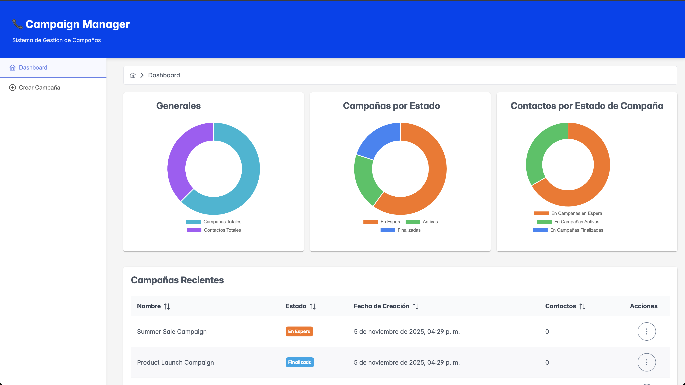
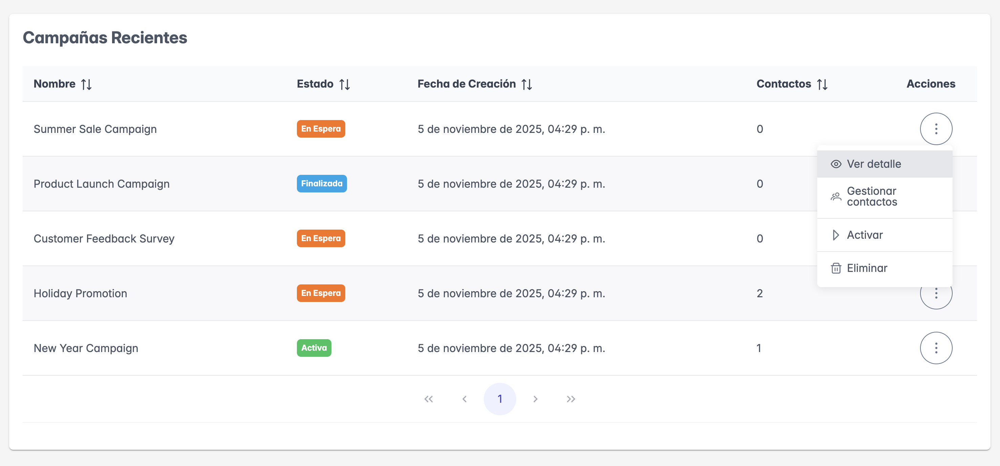
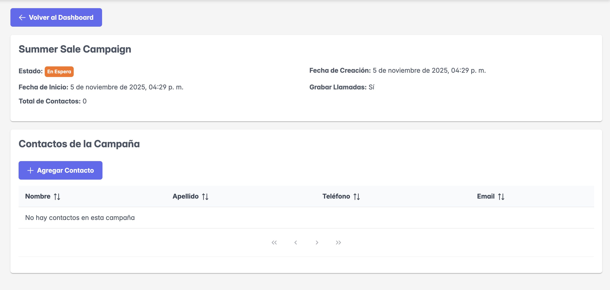
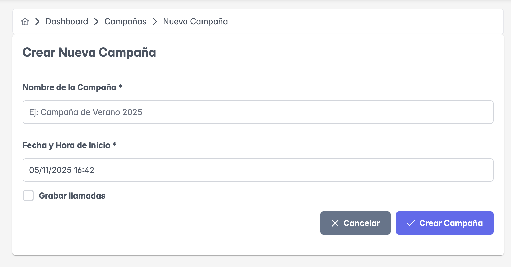
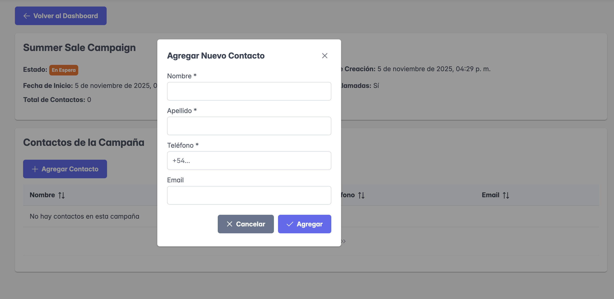

# Campaign Manager - Froneus Challenge
 

Sistema de gestión de campañas de llamadas telefónicas desarrollado con arquitectura de microfrontends usando Single-SPA.



## Características

- ✅ Arquitectura de Microfrontends con Single-SPA
- ✅ 2 MFEs independientes (Home y Campaigns)
- ✅ Gestión completa de campañas (CRUD)
- ✅ Gestión de contactos por campaña
- ✅ Estados de campaña (En Espera, Activa, Finalizada)
- ✅ Responsive Design
- ✅ Persistencia de datos con Zustand
- ✅ Validaciones con feedback visual

## Tecnologías Utilizadas

### Core
- **React 18**  
- **TypeScript**  
- **Single-SPA**  
- **SystemJS** 

### Estado y Datos
- **Zustand** - Gestión de estado global
- **React Router** - Navegación

### UI
- **PrimeReact** - Componentes visuales
- **PrimeIcons** - Iconografía
- **CSS3** - Estilos personalizados

### Build Tools
- **Webpack 5** - Bundler
- **Babel** - Transpilador

## Requisitos Previos

- Node.js >= 16.x
- npm >= 8.x

## 🔧 Instalación

### Opción 1: Script automatizado (recomendado)
```bash
# Clonar el repositorio
git clone https://github.com/jorgerepossi/froneus-microfrontend.git
cd froneus-microfrontend

# Instalar dependencias de todos los MFEs
./install.sh

# O usando npm
npm run install:all
```

### Opción 2: Manual
```bash
# Root Config
cd root-config
npm install

# Home MFE
cd ../home-mfe
npm install

# Campaigns MFE
cd ../campaigns-mfe
npm install
```

## Ejecución

### Iniciar todos los servicios (recomendado)
```bash
npm run start:all
```

Esto levantará:
- Root Config: http://localhost:9000
- Home MFE: http://localhost:8500
- Campaigns MFE: http://localhost:8501

**Acceder a la aplicación:** http://localhost:9000

### Iniciar servicios individuales
```bash
# Terminal 1 - Root Config
npm run start:root

# Terminal 2 - Home MFE
npm run start:home

# Terminal 3 - Campaigns MFE
npm run start:campaigns
```

## Estructura del Proyecto
```
froneus-microfrontend/
├── root-config/              # Shell de Single-SPA
│   ├── src/
│   │   ├── index.ejs        # HTML principal
│   │   └── campaign-root-config.js
│   └── webpack.config.js
│
├── home-mfe/                 # MFE 1 - Dashboard y Gestión
│   ├── src/
│   │   ├── features/
│   │   │   └── dashboard/   # Dashboard y detalle de campañas
│   │   ├── shared/
│   │   │   ├── components/  # Layout compartido
│   │   │   ├── store/       # Zustand store
│   │   │   ├── context/     # Toast context
│   │   │   └── utils/       # Validadores y helpers
│   │   └── App.tsx
│   └── webpack.config.js
│
├── campaigns-mfe/            # MFE 2 - Formularios
│   ├── src/
│   │   ├── features/
│   │   │   └── campaigns/   # Formulario de creación
│   │   ├── shared/          # (código compartido copiado)
│   │   └── App.tsx
│   └── webpack.config.js
│
└── package.json              # Scripts raíz
```

## Arquitectura

El proyecto está dividido en 3 aplicaciones independientes:

- **root-config** (Puerto 9000): Orquestador de Single-SPA
- **home-mfe** (Puerto 8500): Dashboard y gestión de campañas
- **campaigns-mfe** (Puerto 8501): Formulario de creación

Cada microfrontend corre en su propio servidor y Single-SPA los coordina según la ruta.

### Flujo de Datos

```
User Action → Component → Custom Hook → Zustand Store → LocalStorage
                                              ↓
                              React Components (Re-render)
```

##  Funcionalidades

### Dashboard (Home MFE)
- Visualización de estadísticas
- Tabla de campañas con filtros
- Acciones por campaña:
  - Ver detalle
  - Gestionar contactos
  - Activar (solo si está en espera)
  - Finalizar (solo si está activa)
  - Eliminar (solo si está en espera)

### Detalle de Campaña (Home MFE)
- Información completa de la campaña
- Lista de contactos
- Agregar nuevos contactos
- Validaciones en tiempo real

### Crear Campaña (Campaigns MFE)
- Formulario con validaciones
- Campos:
  - Nombre de campaña
  - Fecha y hora de inicio
  - Grabar llamadas (checkbox)

## Reglas de Negocio

### Estados de Campaña
- **En Espera**: Estado inicial, puede ser activada o eliminada
- **Activa**: En ejecución, puede ser finalizada
- **Finalizada**: Estado final, no permite acciones

### Restricciones
- Solo se puede eliminar campañas en estado "En Espera"
- Solo se pueden activar campañas en estado "En Espera"
- Solo se pueden finalizar campañas en estado "Activa"
- Al editar una campaña, solo se pueden agregar contactos
- Los datos de la campaña no pueden modificarse una vez creada

## Responsive

La aplicación está optimizada para:
- Desktop (1920px+)
- Laptop (1024px - 1919px)
- Tablet (768px - 1023px)
- Mobile (< 768px)

## Testing Manual

1. **Crear campaña**
   - Ir a "Crear Campaña"
   - Llenar formulario
   - Verificar que aparece en Dashboard

2. **Agregar contactos**
   - Click en  de una campaña
   - Agregar contacto
   - Verificar en la tabla

3. **Cambiar estados**
   - Activar campaña en espera
   - Finalizar campaña activa
   - Eliminar campaña en espera

4. **Navegación**
   - Navegar entre Dashboard y Crear
   - Verificar que el estado persiste


## 📸 Capturas

### Dashboard


### Dashboard Table


### Detalle de Campaña


### Crear Campaña


### Crear Contacto


##  Troubleshooting

### Puerto ocupado
```bash
# Matar proceso en puerto específico
lsof -ti :9000 | xargs kill -9
lsof -ti :8500 | xargs kill -9
lsof -ti :8501 | xargs kill -9
```

### Limpiar instalación
```bash
cd root-config && rm -rf node_modules package-lock.json
cd ../home-mfe && rm -rf node_modules package-lock.json
cd ../campaigns-mfe && rm -rf node_modules package-lock.json
```

## Autor

**Jorge Repossi**
- GitHub: [@jorgerepossi](https://github.com/jorgerepossi)

## 📄 Licencia

Este proyecto fue desarrollado como parte del challenge técnico de Froneus.
